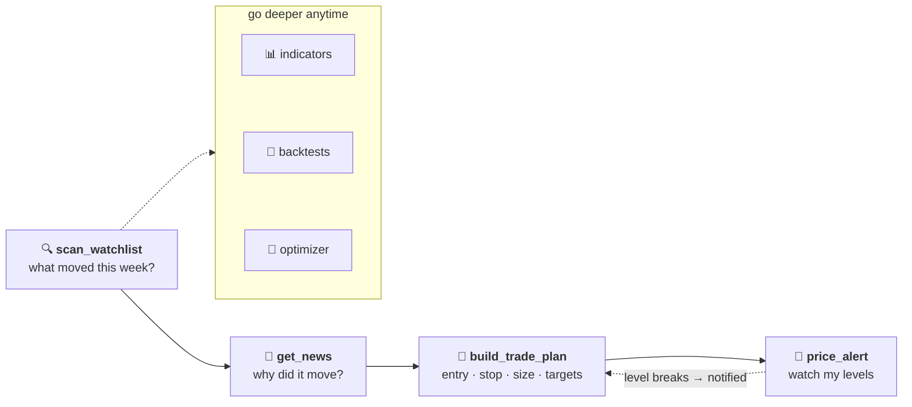

<div align="center">

# 🧠 Quant Brain MCP

**Turn Claude into a quantitative analyst for US and Indian equities.**

Ask in plain English. Get sized trade plans, portfolio optimization, backtests, and price alerts — grounded in real market data, not vibes.

[](https://registry.modelcontextprotocol.io/v0.1/servers?search=quant-brain-mcp)
[](tests/)
[](LICENSE)
[](requirements.txt)

</div>

---

```text
You:    "Scan my watchlist and build a trade plan for whatever looks most actionable.
         ₹2,00,000 equity, 1% risk."

Claude: RELIANCE.NS flagged (at 20-DMA, volume 1.8x average).

        TRADE PLAN — RELIANCE.NS (long)
        Entry           ₹1,310.00
        Stop            ₹1,270.10   (swing low, 2.1 ATR)
        Size            50 shares   (₹65,500 — 32.8% of equity)
        Max loss        ₹1,995      (1.0% of equity)
        Targets         1R ₹1,349.90 · 2R ₹1,389.80 · 3R ₹1,429.70
        Invalidation    Thesis invalid below ₹1,270.10 — exit without debate.
```

No API keys. No accounts. Connect one URL and start asking.

## ⚡ Quickstart

**Claude Desktop / Claude Web** → Settings → Connectors → Add custom connector → **Streamable HTTP**:

```text
https://mcp-quant-brain.onrender.com/mcp
```

That's the whole setup. Try: *"What's RELIANCE trading at, and is it overbought?"*

> Free-tier note: the server sleeps when idle and takes ~50 s to wake. If the first request times out, retry once. Details in [Getting Started](docs/getting-started.md).

## 🛠 What you get — 25 tools

| | Tools | What they answer |
|---|---|---|
| 📋 **Trader workflow** | `get_quote` · `get_news` · `build_trade_plan` · `scan_watchlist` · `price_alert` | *What's it at? What happened? **What do I do?** What moved this week? Tell me when it hits my level.* |
| 📊 **Indicators** | 6 grouped `analyze_*` tools — 38 curated indicators | *Is it overbought? Trending or chopping? How volatile?* |
| 💼 **Portfolio** | `generate_optimized_verdict` — 7 optimization methods | *How do I split my money? What's my risk?* |
| 🧪 **Backtests** | 7 rule-based strategies | *Does this strategy actually work, or does it just feel like it?* |
| 🔭 **Intelligence** | Sector ranking · sector→stock pipeline · company profiles | *Which sector is leading? Which stocks inside it?* |
| 📈 **Charts** | Institutional chart pack, rendered as images | *Show me.* |

Full reference with every parameter: **[docs/tools.md](docs/tools.md)**

## 🔄 The workflow it's built around



## 🔔 Price alerts that survive restarts

```text
You:  "Alert me if RELIANCE drops below ₹1,270"        → stored server-side (Postgres)
      ...
Bot:  "PRICE ALERT FIRED — RELIANCE.NS moved below 1270.00, now at 1268.20"
```

Alerts are one-shot, persist across server restarts, and pair with a scheduled Claude task that checks hourly during market hours and pushes to your phone. Setup in **[docs/price-alerts.md](docs/price-alerts.md)**.

## 🎯 Why this instead of a stock screener?

1. **It answers the trading question, not just the data question.** Indicators tell you RSI is 43. `build_trade_plan` tells you *entry, stop, how many shares, and where your thesis dies* — sized to your account.
2. **India is a first-class citizen.** NSE tickers, NIFTY benchmarking, 8 Indian sector indices, ₹ formatting. Not a US tool with `.NS` bolted on.
3. **The numbers are audited.** Every calculation was adversarially tested against textbook references and live data — 161 automated tests pin the math, including regression tests for 11 real bugs found and fixed along the way. See [docs/architecture.md](docs/architecture.md).
4. **Honest about its data.** Delayed quotes are labeled with timestamps. Stale feeds are flagged, not hidden. FX limitations are disclosed, not papered over.

## 📚 Documentation

| Page | What's in it |
|---|---|
| [Getting Started](docs/getting-started.md) | Connecting from Claude Desktop, Web, and Code; cold starts; troubleshooting |
| [Tool Reference](docs/tools.md) | All 25 tools, every parameter, response shapes |
| [Example Prompts](docs/examples.md) | The prompt cookbook — from one-liners to full workflows |
| [Price Alerts](docs/price-alerts.md) | Persistent alerts + the scheduled watcher pattern |
| [Architecture & Methodology](docs/architecture.md) | How it works, data conventions, the bug audit, telemetry |

## ⚠️ Honest limits

- **Data**: Yahoo Finance. US quotes near-real-time; NSE/BSE ~15 min delayed. Daily bars for analysis.
- **No** options chains, futures, intraday candles, or tick data.
- **Not investment advice.** Educational analysis tooling. Every trade plan says so and means it.

## License

[MIT](LICENSE) — use it, fork it, ship it.
