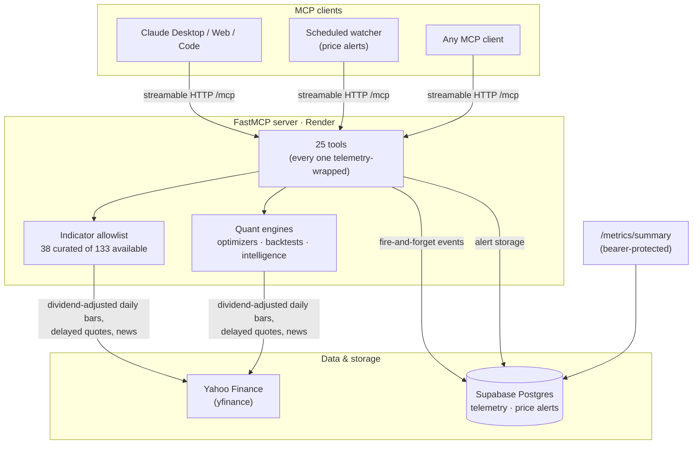

# Architecture & Methodology

How the server works, what conventions the numbers follow, and why you can trust them.

## System overview



- **Server**: Python 3.12, FastMCP over streamable HTTP, stateless mode (survives client reconnects and free-tier restarts).
- **Registration**: every tool registers through one decorator that attaches telemetry — a tool cannot exist without being measured.
- **Indicators**: an explicit 38-indicator allowlist replaced auto-discovery that once exposed 133 tools. Curation is a feature: AI clients pick the right tool far more reliably from 25 than from 133.

## Data conventions

These hold everywhere — a number means the same thing in every tool.

| Convention | Value |
|---|---|
| Prices | Dividend- and split-adjusted ("Close" = total-return basis) |
| Quotes | US near-real-time; NSE/BSE ~15 min delayed — always disclosed with `as_of` |
| Annualization | 252 trading days (Sharpe, volatility) |
| Benchmarks | `.NS`/`.BO` → NIFTY (`^NSEI`); everything else → S&P 500 (`^GSPC`) |
| Backtest fees | 0.1% per trade |
| FX | Cross-currency portfolios computed in local-currency terms; USD/INR risk **not modeled** and disclosed via `fx_note` |
| Freshness | Sector index feeds carry `last_observed_date`; anything >5 days behind the freshest feed is flagged `is_stale` |

## The audit — why the numbers are trustworthy

The codebase went through two systematic correctness audits: parallel reviewers probed every subsystem with executable reproductions, and a second adversarial pass re-ran every claim, killing any finding that didn't reproduce. **11 real bugs survived verification — all fixed test-first, each with a regression test.** The notable ones:

| Bug | Impact before the fix |
|---|---|
| Portfolio weights assigned positionally | 4 of 7 optimizers backtested the **wrong portfolio** — `{NVDA: 0.6, AAPL: 0.3}` could become `AAPL: 0.6, NVDA: 0.3` |
| Sector momentum term inverted | Rewarded sectors for being *further below* their 52-week high; a −10% sector outranked a +19% one |
| 365-day annualization | Every Sharpe inflated 1.2035× — pushing portfolios over "STRONG BUY" thresholds they hadn't met |
| Verdict from first ticker only | The same portfolio gave different risk numbers depending on the order you typed the tickers |
| Unreachable "STAY AWAY" | A portfolio losing 17% with negative Sharpe reported "NEUTRAL" |
| pandas_ta CCI formula | Off by ~200× with the wrong sign (missing parenthesis upstream); reimplemented in-house |
| RSI warmup backfill | Backtest signals could fire on future data during the first 13 bars |
| Raw (unadjusted) prices | Dividends silently excluded from every return — ~9 pp understatement on a 2-year dividend payer |

161 automated tests now pin the behavior, including textbook-reference tests for indicator math and regression tests for each bug above.

## Telemetry

Every tool call records `tool_name`, `tool_category`, `session_id`, `duration_ms`, `success` — written fire-and-forget to Postgres via a background queue, so telemetry can never slow down or fail a tool call. Aggregates are served at:

```text
GET /metrics/summary
Authorization: Bearer <METRICS_TOKEN>
```

returning `total_requests`, `unique_sessions`, `backtests`, `optimizations`, `success_rate`, `p50_latency`, `p95_latency`.

No personal data is stored: sessions are identified by an MCP session header when present, else a coarse client fingerprint.

## Repository layout

```text
fastmcp_server.py         # tool definitions + HTTP routes (the deployed entry point)
core/
  indicator_registry.py   # the 38-indicator allowlist + grouped runner
  data_loader.py          # yfinance fetch, .NS resolution, period validation
  telemetry.py            # instrumentation + Postgres writer
  quant_settings.py       # 252-day annualization convention
tools/
  trading/                # quotes, news, trade plans, watchlist, alerts
  indicators/             # 130+ indicator implementations (38 exposed)
  strategies/             # backtests + sector pipeline
  optimization/           # PyPortfolioOpt-based optimizers
  intelligence/           # alpha/beta engine, company profiles, charts
tests/                    # 161 tests
docs/                     # you are here
```

## Self-hosting

```bash
git clone https://github.com/paarths-collab/quant-brain-mcp
cd quant-brain-mcp
pip install -r requirements.txt
uvicorn render_app:app --host 0.0.0.0 --port 8000
```

Optional environment variables:

| Variable | Purpose |
|---|---|
| `DATABASE_URL` | Postgres URI — enables telemetry + price alerts (tables auto-create). Unset = clean no-op. |
| `METRICS_TOKEN` | Bearer token for `/metrics/summary`. Unset = endpoint returns 503 (fails closed). |

Passwords with special characters (`@`, `#`) in `DATABASE_URL` are handled — paste them raw.
