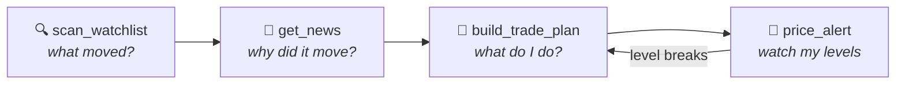

# Example Prompts

Copy, paste, adapt. Claude picks the right tools — you just ask.

## The daily loop

## One-liners

> *"What's RELIANCE trading at?"*

> *"Any news on HINDALCO?"*

> *"Is TCS overbought?"*

> *"Where is AAPL relative to its 200-day moving average?"*

## The Sunday scan

> *"Scan my watchlist — RELIANCE, TCS, HDFCBANK, HINDALCO, SUNPHARMA — and tell me which names actually did something this week. For anything interesting, check the news too."*

## Trade planning

> *"Build me a trade plan for HINDALCO.NS. ₹2,00,000 equity, 1% risk."*

> *"Same but short, and use 2% risk."*

> *"Plan a long on NVDA with $25,000 — and tell me if my order size would move the market."*

## Price alerts

> *"Alert me if RELIANCE drops below ₹1,270 — that's my stop."*

> *"What alerts am I watching?"*

> *"Delete alert 3."*

See [Price Alerts](price-alerts.md) for the scheduled watcher that checks these automatically.

## Strategy validation

> *"Does a 50/200 SMA crossover actually beat buy-and-hold on TCS? Test it over 5 years."*

> *"Backtest RSI mean reversion on HDFCBANK with 25/75 thresholds instead of the defaults."*

> *"Compare MACD momentum vs volatility breakout on RELIANCE over 10 years — which held up better and why?"*

## Portfolio construction

> *"Optimize a portfolio of AAPL, MSFT, NVDA, RELIANCE.NS with ₹5,00,000. Use CVaR — I care about tail risk."*

> *"Same tickers, but compare max Sharpe vs HRP allocations and explain the difference."*

> *"Give me the full verdict on INFY, TCS, HCLTECH over 5 years — and flag anything risky."*

## Sector rotation

> *"Which Indian sector has the best risk-adjusted performance over the last year? Show the correlation matrix too."*

> *"Find the best Indian sector, pick the top stocks inside it, backtest MACD on the winner, and give me a sized trade plan with ₹3,00,000 at 1% risk."*

That last one chains **five tools** — sector ranking → stock scoring → backtest → news → trade plan — and is the single best demo of what this server does.

## Charts

> *"Chart RELIANCE over 2 years with the full institutional pack."*

> *"Plot portfolio diagnostics for AAPL, MSFT, GOOG."*

## Power-user notes

- Every analysis tool takes `period` — say *"over 10 years"* and Claude passes it through.
- Indicator tools take subsets: *"just RSI and MACD"* avoids computing all eight.
- Mixed US + India portfolios work; the verdict includes an `fx_note` reminding you currency risk isn't modeled.
- Ask *"why?"* after any result — Claude has the full response payload (per-ticker breakdowns, score components, data traces) and can explain every number it quoted.
