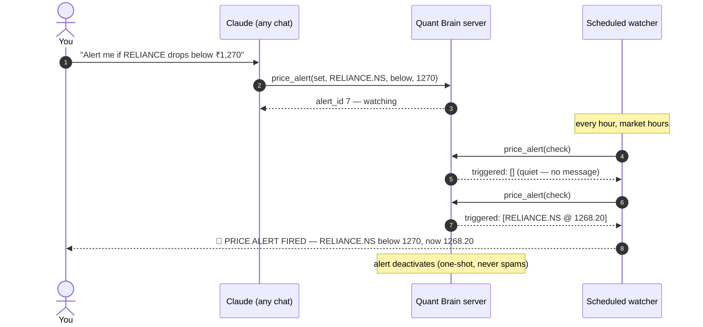

# Price Alerts

Set a level once. Get told when it breaks — even if you haven't opened Claude in days.

## How it works

MCP servers are request/response — a server cannot push a message into Claude on its own. So the alert system splits the job:

- **The server is the memory.** Alerts live in Postgres, survive restarts, and are visible from any device.
- **A scheduled Claude task is the messenger.** It polls `price_alert(action="check")` on a cadence and speaks up only when something fired.



## Setting alerts

In any Claude chat with the connector attached:

> *"Alert me if RELIANCE drops below ₹1,270 — note: my stop level"*

> *"Alert me when NVDA crosses above $320"*

> *"What alerts am I watching?"* · *"Delete alert 3"*

Alert semantics:

- **One-shot** — an alert fires once, then deactivates. A price oscillating around your level produces one notification, not fifty.
- **Direction-aware** — `below` fires at price ≤ level; `above` at price ≥ level.
- **Resilient** — a ticker that can't be fetched right now stays watched; it is never silently dropped.
- **Notes echo back** — whatever context you attach ("stop level", "add zone") returns in the alert.

## Setting up the watcher

Tell Claude (once):

> *"Create a scheduled task that checks my price alerts every hour during Indian market hours (9:15–15:30 IST, weekdays) using the price_alert tool with action 'check' on my Quant Brain connector, and notify me only if any alerts triggered."*

Notes from a working setup:

- **Minimum interval for scheduled cloud tasks is 1 hour.**
- Have the task call the **MCP connector tool directly** (not `curl` — cloud sandboxes may block arbitrary network egress, and the connector route is faster anyway).
- Tell the task to retry once on failure — the free-tier server takes ~50 s to wake from idle.
- The task's run output is your notification surface; runs can also push to your phone via Claude's mobile notifications.

## Choosing a cadence

| Trading style | Cadence | Why |
|---|---|---|
| Positional / swing | Once daily at market close | You act on daily closes anyway |
| Active swing | Hourly during market hours | Catches intraday breaks within the hour |
| Both markets | Hourly around the clock | US names move during IST night |

Honest math: hourly checks + ~15-minute delayed NSE quotes means an alert can arrive up to ~75 minutes after the actual cross. Right for stops-of-record and add zones; wrong for scalping — which is outside this product's scope anyway.

## Direct API access

The alert tool is callable like any MCP tool, so you can also wire it into your own scripts:

```bash
curl -s -X POST https://mcp-quant-brain.onrender.com/mcp \
  -H "Content-Type: application/json" \
  -H "Accept: application/json, text/event-stream" \
  -d '{"jsonrpc":"2.0","id":1,"method":"tools/call","params":{
        "name":"price_alert",
        "arguments":{"action":"set","ticker":"RELIANCE.NS","level":1270,"direction":"below"}}}'
```
